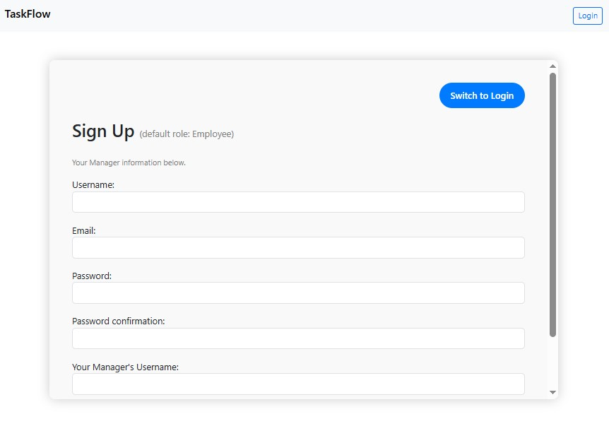
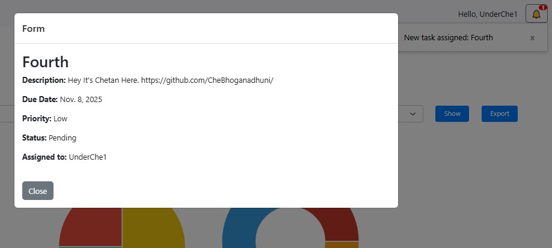
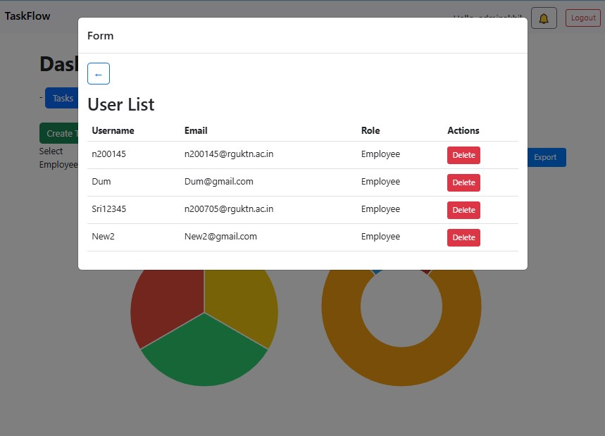
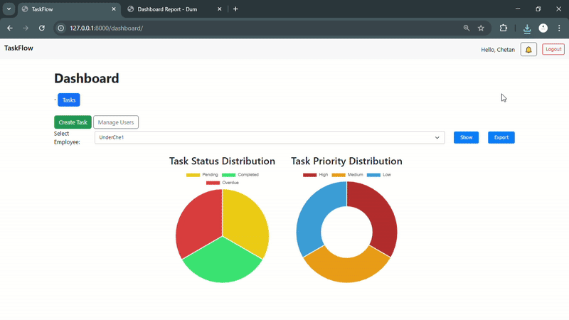
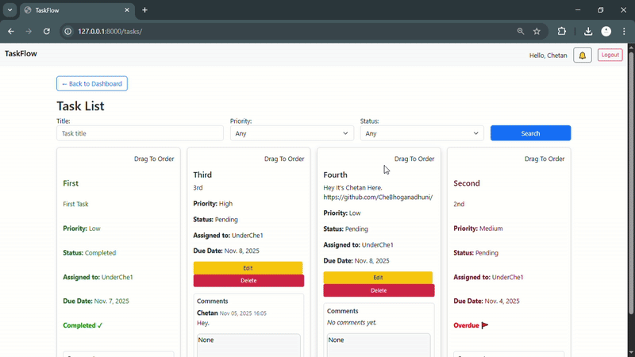

# ✅ TaskFlow – Smart Task & Team Management Platform

TaskFlow is a modern **Django + PostgreSQL** powered web application designed for efficient team task management.  
Built with role‑based access, beautiful UI, asynchronous email alerts, analytics, PDF exports, and real‑time collaboration 

---

## ✨ Key Features

### 👥 User Roles & Management
- Manager & Employee roles
- Invite‑code system for manager signup
- Manager‑controlled employee creation management
- Only manager‑assigned employees visible
- Secure permission checks
- Delete users + optional goodbye email

### 🔐 Authentication
- Login / Signup system
- Forgot password + email recovery flow
- Smooth validation & user‑friendly messages

### ✅ Task Management
- Create, edit, delete tasks
- Priority, due date, progress states
- Assign employees
- Overdue detection & highlighting
- Real‑time notifications
- Drag‑and‑drop task ordering (saved automatically!)

### 💬 Collaboration
- Threaded task comments with timestamps
- Manager & employee messaging per task

### 📊 Analytics & Reports
- Dashboard with task insights
- Priority breakdown + status charts (Chart.js)
- Export PDF reports with styling + charts

### 🎨 UI / UX
- Bootstrap clean UI
- Smooth modals & AJAX interactions
- Toasts, alerts, responsive design

### 📧 Email System
- Async mail for:
  - Invite success
  - Task updates
  - Password reset
  - User goodbye mail

### 📄 PDF Export (WeasyPrint)
- Styled dashboard PDF
- Table + cards + chart export

---

## 🎥 Demo

### 🔁 Task Drag & Drop + Auto Save


---

## 📸 Screenshots

### Sign Up


### Notifications


### Employee Panel


---

## Demo 🎯

### Exports


### Task Page 


---

## 🛠 Tech Stack

| Component | Tech |
|---|---|
| Backend | Django 5.2, Python 3.11 |
| DB | PostgreSQL |
| UI | Bootstrap 5 |
| Charts | Chart.js |
| PDF Engine | WeasyPrint + GTK |
| Auth | Django auth system |
| Misc | AJAX, jQuery, SortableJS |

---

## ⚙️ Setup & Installation

### **1️⃣ Clone Repo**
```
git clone https://github.com/CheBhoganadhuni/TaskFlow.git
cd TaskFlow
```

### **2️⃣ Create Virtual Env & Install Dependencies**
```
python -m venv venv
source venv/bin/activate   # Linux/Mac
venv\Scripts\activate    # Windows

pip install -r requirements.txt
```

### **3️⃣ Database Setup**
```
CREATE DATABASE your_db;
CREATE USER your_user WITH PASSWORD 'your_password';
GRANT ALL PRIVILEGES ON DATABASE your_db TO your_user;
```

### **4️⃣ Environment File (.env)**
```
SECRET_KEY=your-secret-django-key
DB_NAME=your_db
DB_USER=your_user
DB_PASSWORD=your_password
DB_HOST=localhost
DB_PORT=5432

EMAIL_HOST_USER=you@example.com
EMAIL_HOST_PASSWORD=your-app-password
MANAGER_INVITE_CODE=your-invite-code
```

> ⚠️ Don’t commit `.env` file.

### **5️⃣ Apply Migrations & Run**
```
python manage.py makemigrations
python manage.py migrate
python manage.py createsuperuser
python manage.py runserver
```

Access at: http://127.0.0.1:8000/

---

## 🧠 Usage Guide

| Role | Can do |
|---|---|
| Manager | Manage users, tasks, PDF exports, insights |
| Employee | View tasks, comment, mark done |

---

## 🧾 GTK Setup for PDF (Linux/macOS)
**Linux**
```
sudo apt install libgtk-3-0 libffi-dev libcairo2 libpango1.0-0 libgdk-pixbuf2.0-0 libxml2 libssl-dev
```

**Mac**
```
brew install gtk+3
```

Windows — see WeasyPrint official docs.

---

## 🤝 Contributing
PRs welcome! Fork, feature branch, PR.

---

## 📄 License
MIT License

---

🚀 Built with caffeine by **Chetan Bhoganadhuni**
